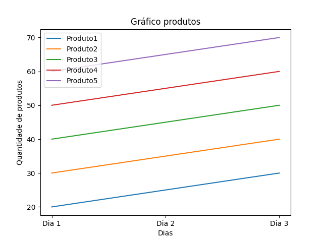
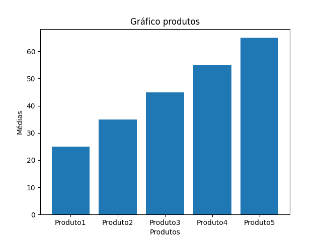

<h1> Trabalho da matéria Paradigmas de linguages de programação em Python </h1>

Objetivo

- A empresa ABC Ltda. registra suas vendas diárias em um arquivo CSV chamado "vendas.csv", com dados separados por vírgula. Cada linha do arquivo representa as vendas de um dia, e cada coluna representa um produto diferente. A empresa oferece 5 produtos diferentes. O gerente deseja entender melhor o desempenho das vendas. Sua tarefa é analisar os dados de vendas e fornecer insights visualizados sobre as vendas dos produtos
 
<h3> Tarefas </h3>

1 - Calcule a média, mediana e desvio padrão das vendas diárias de cada produto usando a biblioteca NumPy.

2 - Crie e salve em arquivo .png um gráfico de linhas mostrando as vendas diárias de cada produto ao longo do tempo usando biblioteca Matplotlib

3 - Crie e salve em arquivo .png um gráfico de barras mostrando a média de vendas de cada produto usando a biblioteca Matplotlib

### Resolução Tarefa 1:

A tarefa 1 encontra-se no arquivo <b>project/specs_produtos.py</b>, vamos ao código:

- Estamos utilizando a lib <b>pandas</b> para ler o arquivo .csv e a lib <b>numpy</b> para manipular os dados deste arquivo 

```python
import pandas as pd
import numpy as np
```

- Nesta primeira parte, utilizamos da função <b>read_csv()</b> própria do <b>pandas</b> para ler o arquivo e o armazenamos em uma variável <b>arquivo</b>

``` python
arquivo = pd.read_csv('vendas.csv')
```

- Na última parte do código definimos um valor para a variável <b>count</b> para funcionar como contador dentro do laço. Já dentro deste laço, utilizamos a função <b>array()</b> para manipular os dados do .csv como uma lista, <b>mean()</b> para calcular a média, <b>median</b> para cacular a mediana e <b>std()</b> para calcular o desvio padrão de cada produto. Todas essas funções pertencem à biblioteca <b>NumPy</b>.

``` python
count = 0

for produto in arquivo.columns:
    dados = np.array(arquivo[produto])
    medias = np.mean(dados)
    mediana = np.median(dados)
    desvio_padrao = np.std(dados)
    print(f"A media do produto {count+1} é {medias}, a mediana é {mediana}, e o desvião padrão é {desvio_padrao}")
    count = count+1
```

- Rodando este arquivo, temos como output:

``` 
A media do produto 1 é 25.0, a mediana é 25.0, e o desvião padrão é 4.08248290463863
A media do produto 2 é 35.0, a mediana é 35.0, e o desvião padrão é 4.08248290463863
A media do produto 3 é 45.0, a mediana é 45.0, e o desvião padrão é 4.08248290463863
A media do produto 4 é 55.0, a mediana é 55.0, e o desvião padrão é 4.08248290463863
A media do produto 5 é 65.0, a mediana é 65.0, e o desvião padrão é 4.08248290463863
```

### Resolução Tarefa 2:

A tarefa 2 encontra-se no arquivo <b>project/produtos_dias.py</b>, vamos ao código:

- Estamos utilizando a lib <b>pandas</b> para ler o arquivo .csv, a lib <b>numpy</b> para manipular os dados deste arquivo e lib <b>matplotlib.pyplot</b> para fazer a criação do gráfico. 

``` python
import pandas as pd
import matplotlib.pyplot as plt
import numpy as np
```

- Nesta primeira parte, utilizamos da função <b>read_csv()</b> própria do <b>pandas</b> para ler o arquivo e o armazenamos em uma variável <b>arquivo</b>

``` python
arquivo = pd.read_csv('vendas.csv')
```

- Na última parte do código, defino uma variável que recebe uma lista como valor, aonde defino a quantidade de dias de vendas. Dentro do laço manipulo os dados do arquivo .csv com a função <b>array()</b> da biblioteca <b>NumPy</b> e crio o gráfico com a função <b>plot()</b> da biblioteca <b>matplotlib.pyplot</b>. A função <b>title()</b> adiciona um título ao gráfico, <b>xlabel()</b> adiciona um rótulo ao eixo x, <b>ylabel()</b> adiciona um rótulo ao eixo y, <b>legend()</b> adiciona uma legenda e a <b>show()</b> mostra o gráfico.

``` python
dias = ["Dia 1", "Dia 2", "Dia 3"]

for produto in arquivo.columns:
    dados = np.array(arquivo[produto])
    plt.plot(dias, dados, label=produto)

plt.title("Gráfico produtos")
plt.xlabel("Dias")
plt.ylabel("Quantidade de produtos")
plt.legend()
plt.show()
```
- Rodando este arquivo, temos como output:



### Resolução Tarefa 3:

A tarefa 3 encontra-se no arquivo <b>project/media_produtos.py</b>, vamos ao código:

- Estamos utilizando a lib <b>pandas</b> para ler o arquivo .csv, a lib <b>numpy</b> para manipular os dados deste arquivo e lib <b>matplotlib.pyplot</b> para fazer a criação do gráfico. 

``` python
import pandas as pd
import matplotlib.pyplot as plt
import numpy as np
```

- Nesta primeira parte, utilizamos da função <b>read_csv()</b> própria do <b>pandas</b> para ler o arquivo e o armazenamos em uma variável <b>arquivo</b>

``` python
arquivo = pd.read_csv('vendas.csv')
```

- Na segunda parte do código, crio uma variável <b>produtos</b> para conseguir manipular os valores de cada coluna do Dataframe do pandas diretamente e crio outra varíavel <b>medias</b> para receber os valores das médias.

``` python
produtos = arquivo.columns.tolist()

medias = []
```

- Na última parte do código, dentro do laço manipulo os dados do arquivo .csv com a função <b>array()</b> e calculo as médias utilizando a função <b>mean</b>da biblioteca <b>NumPy</b> e adiciono essas informações na lista utilizando a função <b>append()</b>. Já, fora do laço, crio o gráfico de barra com a função <b>bar()</b> da biblioteca <b>matplotlib.pyplot</b>. A função <b>title()</b> adiciona um título ao gráfico, <b>xlabel()</b> adiciona um rótulo ao eixo x, <b>ylabel()</b> adiciona um rótulo ao eixo y, <b>legend()</b> adiciona uma legenda e a <b>show()</b> mostra o gráfico.

``` python
for produto in produtos:
    dados = np.array(arquivo[produto])
    media_produto = np.mean(dados)
    medias.append(media_produto)

plt.bar(produtos, medias)
plt.title("Gráfico produtos")
plt.xlabel("Produtos")
plt.ylabel("Médias")
plt.show()
```

- Rodando este arquivo, temos como output:

